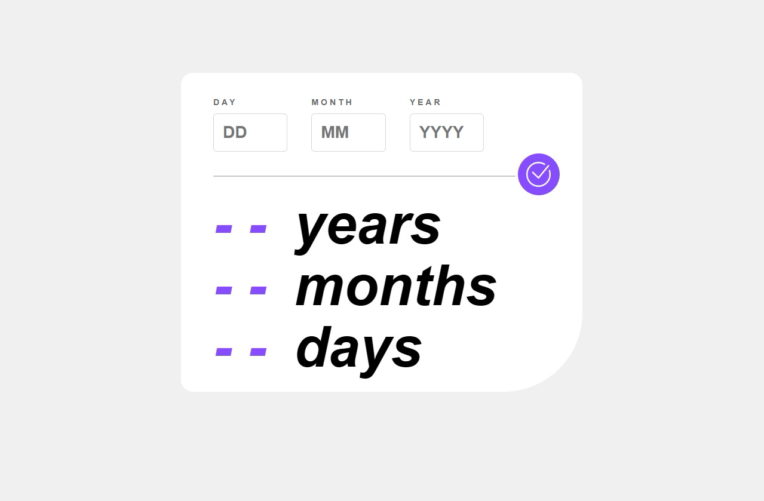

# Age-Calculator
این UI یک ماشین‌حساب سن است که با HTML، CSS و JavaScript ساخته شده است. کاربران می‌توانند تاریخ تولد خود را (روز، ماه، سال) وارد کنند و با کلیک روی دکمه تأیید، سن خود را به‌صورت سال، ماه و روز دریافت کنند. طراحی ساده و شیک دارد و برای وب‌سایت‌ها یا برنامه‌های مرتبط با محاسبات شخصی مناسب است.

